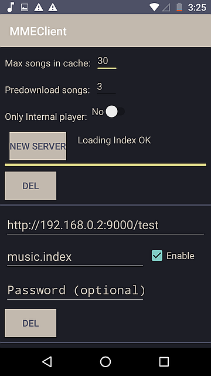

# MMECLient Documentation

MMeClient means Minio Media Client, and it is the complement of a Minio Music Server [here](https://github.com/Javierenrique00/minio_Music_Server).

MMeClient is an Android app (Free and without advertising also) that you can download in Google Play Store. See, [MMeClient](https://play.google.com/store/apps/details?id=com.mundocreativo.javier.mmeclient&hl=en)

MMeClient reads the Minio Music Server Index file, and with it you can find, download and play files that are stored in a Minio server or public cloud storage. ( Amazon S3, Google storage, Azure, Backblaze B2 and other public anonimous storage)

_MMeClient Screenshot_

# Instrucctions to use MMeClient app.

## 1- Configuring access to Media Storage

When you enter for the first time to MMeClient, the first thing to do is configuring the access to the Media Storage.

You have to select the "spanner" in the upper right of the screen in order to configure settings, including the access to the Media Storage.

Here you can configure the app. You can leave the defaults.

**Max songs in cache:** default(30) Is the max number of songs that the app keeps downloaded (ocupiying storage in the android device) when you select play songs of a directory or a group of songs. If you choose a big number the Android device can get run out of storage space.

**Predownload songs:** default(2) Is the number of songs that the app try to download in advance in a queue of songs before the song needs to be played.

**Only Internal Player:** default(Yes) The app has an internal player for audio files. This internal player can load music to the play queue with one touch of a directory or group of selected files. But you can also use an external player like (Vanilla Music) or VLC or other external player. The difference is that for an external player you can only add music one file at the time. In the internal player you can add music to the queue songs on any number of selected songs or directories.

note:in Vanilla Music is possible to add a song to a music queue.

Then push the button called **"New Server"**. With this button you can see 4 fields that you need to configure for adding a storage.

**Address path field** In the first field you need to put the full address where the storage is located, including the bucket. in the screenshoot the bucket is **test**.

Examples of address are:

https://storage.googleapis.com/mystorage

https://f001.backblazeb2.com/file/mybucket

**Index file field** This is the second field, is the name of the index file in the above path.
**Enable Field** Default is disabled, but if you selected it, it tries to download the index file. Leave enable to see the files in the storage.
**Password field** If your storage is encrypted write the password in this field. (Optional) and then select **enable** to read the encrypted index file.

You can have multiple storages at the same time, but only you can download media files if they are **enabled**.

If your index file change (Bacause you add some files or delete files), you need to reload the index file. To reload the index file, set enable OFF, and enable it again.

You exit the configuration screen with Back button.

## 2- Knowing the interface

There are two complementary screens in the app to work with media files. One is the **Search screen**, and the other is the **Directory screen**.

### The search Screen

The search screen use all of the songs in the server to search for a word that can be a part of the name of the song, or part of the directory, or part of the album or artist. You can filter this results to see only the files that are in the cloud storage or minio server or the local downloaded files.

In (1) you enter the search part.
In (2) you filter the results by cloud or local storage.

You can see the resuls scrolling the screen up and down. Then you can select the songs for download (3), to delete(4) or play(5).

If you want to select all of the searched songs you can select or deselect all with (6)

You can hide the internal player touching the album icon or the Show/hide player icon (7)

To go from the Search Screen to directory screen you need to **swipe to the right** in the songs list.

To return from the directory screen to a search screen you need to **swipe to the left**.

### The directory Screen

In the directory screen you can see the root bucket of the cloud storage with the size of the folders and files. Then you can navigate in the directory structure.

You can play all of the songs inside a folder or group of folders that are selected. In order to select a folder you need to make a long push of the folder until the selection symbol appears. Then select Add songs to the queue and play (2).

You can use the android back button(3) or the Directory up button (1) to navigate up in the directory structure.

You can navigate to the search screen with a swipe to the left(4).

